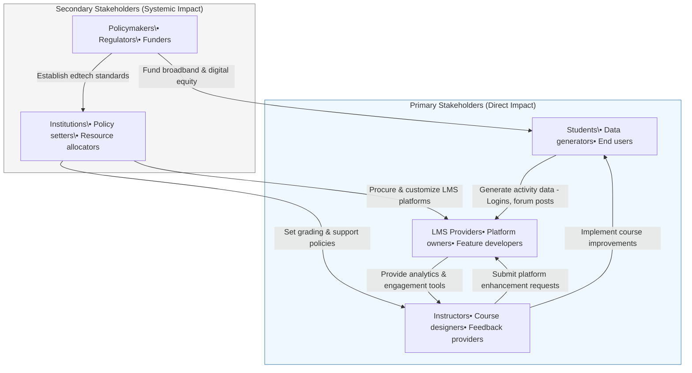

# Stakeholder Analysis: Online Learning Engagement

## Primary Stakeholders

### 1. Students

- **Role**: Primary users of online learning platforms
- **Influence**:
  - Engagement behaviors (logins, forum participation, assignment completion)
  - Feedback on course effectiveness
- **Pain Points**:
  - Isolation and lack of motivation
  - Difficulty managing self-paced learning
  - Technical challenges with platforms
- **Data Sources**:
  - LMS activity logs
  - Forum participation metrics
  - Assignment submission patterns
- **Intervention Opportunities**:
  - Personalized learning dashboards
  - Automated engagement nudges
  - Peer support networks

### 2. Instructors

- **Role**: Course designers and facilitators
- **Influence**:
  - Course structure and content delivery
  - Feedback frequency and quality
  - Interaction patterns with students
- **Pain Points**:
  - Difficulty monitoring engagement remotely
  - Time constraints for personalized feedback
  - Challenges in creating interactive content
- **Data Sources**:
  - Instructor-student interaction logs
  - Feedback response times
  - Course design metadata
- **Intervention Opportunities**:
  - Engagement analytics dashboards
  - Automated alert systems for at-risk students
  - Template libraries for interactive content

### 3. LMS Providers

- **Role**: Platform developers and maintainers
- **Influence**:
  - System features and usability
  - Data collection capabilities
  - Accessibility and mobile support
- **Pain Points**:
  - Balancing privacy with engagement tracking
  - Supporting diverse pedagogical approaches
  - Technical limitations in analytics
- **Data Sources**:
  - Platform usage statistics
  - Feature adoption rates
  - Support ticket analysis
- **Intervention Opportunities**:
  - Enhanced engagement tracking tools
  - Gamification features
  - Predictive analytics APIs

## Secondary Stakeholders

### 4. Educational Institutions

- **Role**: Policy makers and administrators
- **Influence**:
  - Enrollment and grading policies
  - Support service allocation
  - Technology investment decisions
- **Pain Points**:
  - Retention and completion rates
  - Resource allocation challenges
  - Measuring program effectiveness
- **Data Sources**:
  - Institutional performance metrics
  - Student satisfaction surveys
  - Retention/attrition statistics
- **Intervention Opportunities**:
  - Data-driven policy adjustments
  - Targeted support programs
  - Faculty training initiatives

### 5. Policymakers/Government

- **Role**: Education system architects
- **Influence**:
  - Broadband infrastructure funding
  - Digital education standards
  - Accessibility regulations
- **Pain Points**:
  - Digital divide in education access
  - Measuring ROI on edtech investments
  - Ensuring equitable access
- **Data Sources**:
  - National education statistics
  - Digital access surveys
  - Program evaluation studies
- **Intervention Opportunities**:
  - Infrastructure grants
  - Digital literacy programs
  - Public-private partnerships

## Stakeholder Relationships

