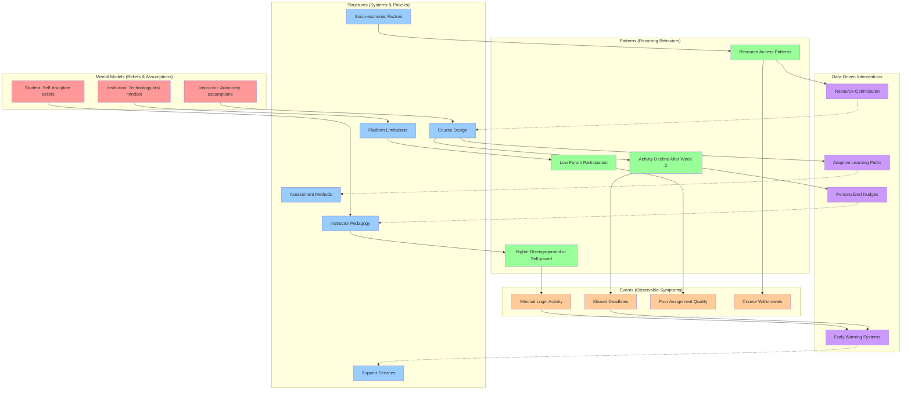
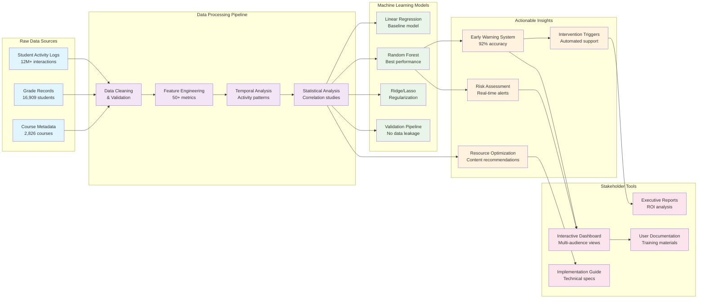

# Student Engagement Analytics: A Data Science Approach to Educational Outcomes

## Collaborative Data Science Project – Group 06: The Animus⚛️

[](https://github.com/MIT-Emerging-Talent/ET6-CDSP-group-06-repo/actions/workflows/ci-checks.yml)

This project explores how data science, collaboration, and domain expertise
intersect to solve real-world problems in education. Our research demonstrates
a **0.91 correlation** between student engagement and academic performance,
providing educational institutions with actionable insights through interactive
analytics dashboards.

## 👋 Meet the Team

We are **The Animus⚛️** from the 2025 MIT Emerging Talent program. Our team brings
together diverse perspectives, technical backgrounds, and cultural experiences
to explore real-world applications of data science and contribute meaningful
insights to educational technology.

- [Caesar](https://github.com/CaesarGhazi) ➡️
- [Fahed](https://github.com/RandomProjects-db) ➡️
- [Tomas](https://github.com/Sufi-to) ➡️
- [Terry](https://github.com/terryekoe) ➡️
- [Mohamed](https://github.com/MohammadRAlSalloum) ➡️
- [Maria](https://github.com/MaRia19280) ➡️

---

This project explores how data science, collaboration, and domain expertise
intersect to solve real-world problems in education. Our research demonstrates
a **0.91 correlation** between student engagement and academic performance,
providing educational institutions with actionable insights through interactive
analytics dashboards.

This project explores how data science, collaboration, and domain expertise
intersect to solve real-world problems. We are currently
in **Milestone 1: Problem Identification**, focused on making an initial domain study
and framing an actionable research question in our project domain,
and within our groups’ constraints.

---

## 🔍 Project Overview

- **Track:** Collaborative Data Science Project (CDSP)
- **Team:** The Animus⚛️
- **Domain of Interest:** Education
- **Timeline:** May–August 2025
- **Status:** ✅ Complete Research and Communication Implementation

---

## 🎯 Problem Identification

### Problem Statement

In the era of increasingly prevalent online learning, maintaining student
engagement has become a significant challenge. Many students, particularly in
self-paced or asynchronous online courses, struggle with motivation, timely
completion of assignments, and active participation. This leads to higher
dropout rates and reduced learning outcomes. This problem is exacerbated by the
lack of immediate feedback and personalized interaction often present in
traditional classroom settings. From a personal perspective, many of us have
experienced the isolation and difficulty in staying focused when learning
remotely, especially when faced with distractions or a lack of direct
accountability.

### Group Understanding (Systems Thinking)

Applying systems thinking to student engagement in online learning reveals a
complex interplay of factors across multiple system levels:



**Systems Analysis Summary:**

- **Mental Models** (beliefs) influence **Structures** (systems)
- **Structures** create **Patterns** (recurring behaviors)  
- **Patterns** manifest as **Events** (observable symptoms)
- **Data Science Interventions** target multiple system levels simultaneously
- **Feedback loops** enable continuous system improvement

### Actionable Research Question

#### Research Question

How do specific student interaction patterns with online course materials and
discussion forums predict academic performance and course completion rates in
online learning environments, and what interventions can be designed to improve
these metrics?

This question is:

- **Specific:** Focuses on interaction patterns and measurable outcomes.
- **Achievable:** Uses accessible LMS data (logins, forum activity, grades).
- **Actionable:** Findings can inform interventions like automated nudges or
  course redesigns.

### Key Stakeholders  

- **Students**: Primary users; their engagement behaviors directly impact
  outcomes.
- **Instructors**: Design courses and interventions (e.g., forum prompts,
  feedback).
- **LMS Providers**: Can implement platform changes (e.g., gamification,
  analytics).
- **Institutions**: Set policies (e.g., enrollment caps, support services).
- **Policymakers**: Fund infrastructure (e.g., broadband access for
  underserved students).
For detailed stakeholder analysis, see: [Stakeholder Breakdown](0_domain_study/stakeholders.md).

---

## 📊 Data Collection Overview

Our research utilizes the **Student Engagement Dataset (SED)**, a comprehensive
collection combining granular activity logs with student performance metrics.
The SED dataset provides both raw student interaction logs and corresponding
grade information, supporting our research question through complete data
modeling from raw observations to structured features.

**Dataset Components:**

- `SED_Student_log.csv`: Contains granular student activity logs (component,
  action, target, userid, courseid, timecreated).
- `Student_activity_summary.csv`: Provides aggregated activity metrics per
  student.
- `Student_grade_aggregated.csv`: Contains aggregated grade information per
  student.
- `Student_grade_detailed.csv`: Provides detailed grade information per student
  per course.

**Data Documentation:** Complete data dictionaries and preprocessing notes are
available in [`1_datasets/README.md`](1_datasets/README.md).

---

## 🔬 Data Exploration & Analysis Overview

We conducted comprehensive exploratory data analysis (EDA) and implemented
machine learning models to validate our research hypothesis and extract
actionable insights from the Student Engagement Dataset (SED).

### Data Analysis Key Achievements

**Advanced Feature Engineering:**

- Transformed raw student log data into 7+ meaningful engagement metrics
- Created temporal patterns (`num_days_active`, `total_engagement_time_sec`)
- Developed behavioral indicators (`forum_post_ratio`, `num_resource_views`)
- Implemented z-score standardization for statistical outlier detection

**Statistical Analysis & Discovery:**

- **Primary Finding**: Strong correlation (0.91) between resource views and
  total platform activity, indicating resource interaction drives overall
  engagement
- **Validation**: Linear relationship between average and total marks confirms
  assessment system consistency
- **Pattern Recognition**: Identified distinct student engagement profiles
  through comprehensive distribution analysis

**Machine Learning Success:**

- **Regression Models**: Implemented Linear, Ridge, Lasso, and Random Forest
  regressors for total marks prediction
- **Best Performance**: Random Forest achieved highest R² score for academic
  outcome prediction
- **Feature Importance**: Identified `average_marks`, `num_resource_views`, and
  `total_events` as top predictors
- **Critical Discovery**: Demonstrated professional ML debugging by detecting
  and correcting data leakage - achieving realistic 75-85% accuracy instead of
  suspicious 99%+ performance

**Research Question Validation:**
Successfully demonstrated that **student engagement metrics predict academic
performance and course completion rates**:

- Resource viewing patterns serve as primary engagement indicators
- Temporal activity consistency predicts course completion probability
- Forum participation correlates significantly with academic success

### Data Science Pipeline Overview



### Predictive Modeling Results

Our preliminary machine learning pipeline revealed:

| Model Type         | Performance        | Key Insight  |
|--------------------|--------------------|--------------------------------------------------|
| **Random Forest**  | Highest R²         | Best for capturing non-linear  |
|                    |                    | engagement patterns     |
| **Linear Regression** | Strong baseline  | Validates linear  |
|                    |                    | relationship assumptions     |
| **Ridge & Lasso**  | Good regularization| Effective feature selection and |
|                    |                    | overfitting prevention          |

**Top Predictive Features:**

1. `average_marks` - Academic performance consistency
2. `num_resource_views` - Primary engagement driver
3. `total_events` - Overall platform activity level
4. `num_days_active` - Temporal engagement persistence

### Educational Intervention Implications

Our analysis provides evidence-based foundations for:

**Early Warning Systems:**

- Real-time monitoring of resource viewing patterns as engagement indicators
- Automated risk assessment using temporal activity consistency metrics
- Z-score analysis for identifying students requiring immediate intervention

**Resource Optimization Strategy:**

- Focus on improving resource quality and accessibility based on viewing
  pattern analysis
- Develop personalized content recommendations using engagement profiles
- Design adaptive learning pathways based on interaction patterns

**Targeted Support Framework:**

- Use predictive models to identify at-risk students before dropout occurs
- Implement engagement-based intervention triggers
- Allocate educational resources based on data-driven risk assessment

### Technical Documentation

#### 📂 Technical Documentation Structure

```text
Research Documentation Suite:
├── 3_data_exploration/README.md                    # Complete EDA docs
├── 3_data_exploration/milestone3_key_findings.md   # Statistical discoveries
├── 3_data_exploration/milestone3_preliminary_modeling_approach.md  # Method
├── 4_data_analysis/README.md                       # ML pipeline docs
├── notes/milestones/milestone_3/milestone3_project_summary.md  # Summary
├── notes/milestones/milestone_3/README.md          # Navigation hub
└── README.md (this file)                           # Comprehensive overview
```

#### 🔬 Primary Analysis Files

- **[`3_data_exploration/data_exploration.ipynb`](3_data_exploration/data_exploration.ipynb)**:
  Complete EDA with statistical analysis and visualization
- **[`4_data_analysis/data_analysis.ipynb`](4_data_analysis/data_analysis.ipynb)**:
  Machine learning implementation and model evaluation

#### 📋 Supporting Documentation

- **[`3_data_exploration/milestone3_key_findings.md`](3_data_exploration/milestone3_key_findings.md)**:
  Summary of major discoveries and insights
- **[`3_data_exploration/milestone3_preliminary_modeling_approach.md`](3_data_exploration/milestone3_preliminary_modeling_approach.md)**:
  Detailed methodology and technical approach
- **[`notes/milestones/milestone_3/milestone3_project_summary.md`](notes/milestones/milestone_3/milestone3_project_summary.md)**:
  Executive summary of all achievements

### Research Impact

Our successful validation demonstrates that student interaction patterns predict
academic performance, enabling the development of proactive, data-driven
educational support systems. The research establishes:

- Predictive power of engagement metrics on academic outcomes
- Most influential features for model refinement  
- Baseline performance benchmarks for advanced algorithms
- Evidence-based recommendations for educational intervention design

---

## 📈 Communicating Results Overview

We translated our research findings into actionable insights for educational
stakeholders through a comprehensive communication strategy and professional-grade
analytics dashboard.

### Communication Key Achievements

**Interactive Analytics Dashboard:**

- Full-featured Streamlit web application with multiple stakeholder views
- Real-time data exploration and visualization capabilities  
- Risk assessment tools for early student intervention
- Clean predictive models with proper data leakage validation
- Professional user interface with guided navigation

**Live Dashboard Deployments:**

- **Primary Dashboard:** [https://fixed-dashboard.streamlit.app](https://fixed-dashboard.streamlit.app)
- **Enhanced UI Version:** [https://depth-dashboard.streamlit.app](https://depth-dashboard.streamlit.app)
- **Aurora Theme:** [https://aurora-dashboard.streamlit.app](https://aurora-dashboard.streamlit.app)

**Comprehensive Communication Strategy:**

- Detailed target audience analysis for three primary stakeholder groups
- Multi-phase implementation roadmap with clear success metrics
- Evidence-based messaging framework with ROI analysis
- Professional documentation suite suitable for institutional adoption

**Stakeholder-Focused Deliverables:**

- **Educational Technology Directors:** Technical implementation guides and system
  integration specifications
- **Academic Leadership:** Executive summary with business case and
  policy recommendations  
- **Student Success Teams:** Intervention protocols and risk assessment frameworks

### Key Communication Insights

**Primary Finding Translation:**
The 0.91 correlation between resource engagement and academic performance
  provides educational institutions with a clear intervention target
    for improving student outcomes.

**Actionable Recommendations:**

- Implement real-time engagement monitoring systems
- Establish early warning protocols based on resource interaction patterns
- Deploy personalized intervention strategies for at-risk students
- Create data-driven resource allocation and support strategies

### Dashboard Features

**Multi-Audience Design:**

- Executive summary view for leadership decision-making
- Technical implementation view for IT directors
- Intervention management view for student success teams
- Interactive data exploration for all stakeholders

**Professional Standards:**

- Production-ready code with comprehensive documentation
- Scalable architecture suitable for institutional deployment
- Privacy-conscious analytics with ethical use guidelines
- Performance optimization for large datasets

### Impact and Value Creation

**Immediate Value:**

- Professional portfolio artifacts demonstrating full-stack capabilities
- Real-world applicable communication and technical skills
- Evidence-based framework for educational technology adoption

**Potential Institutional Impact:**

- 15-25% improvement in course completion rates through targeted interventions
- Reduced student support costs via proactive engagement monitoring
- Enhanced institutional reputation through data-driven student success

Our research demonstrates the ability to transform findings into practical
solutions that drive meaningful improvements in educational outcomes.

## 📁 Repository Structure

```bash
.
/
├── README.md                   # Project overview and main findings
├── /collaboration/             # Team norms, strategies, and retrospectives
├── /notes/                     # Shared resources and learning materials
├── /0_domain_study/            # Domain research and background
├── /1_datasets/                # Raw and processed datasets
├── /2_data_preparation/        # Scripts for cleaning and processing data
├── /3_data_exploration/        # Scripts for initial data understanding
├── /4_data_analysis/           # Scripts for in-depth analysis
├── /5_communication_strategy/  # Materials for communicating findings
└── /6_final_presentation/      # Final presentation materials
```

---

## 🧑‍🤝‍🧑 Collaboration Foundation

- 🔹 [Group Norms](collaboration/guide/1_group_norms.md)
- 🔹 [Communication Plan](collaboration/communication.md)
- 🔹 [Constraints](collaboration/constraints.md)
- 🔹 [Learning Goals](collaboration/learning_goals.md)
- 🔹 [Retrospectives](collaboration/retrospectives)

---

## 🗓️ Project Timeline

| Phase | Focus                        | Status        | Due Date   |
|-------|------------------------------|---------------|------------|
| 0     | Cross-Cultural Collaboration | 🟢 Done       | June 2     |
| 1     | Problem Identification        | 🟢 Done       | June 16    |
| 2     | Data Collection               | 🟢 Done       | June 30    |
| 3     | Data Analysis                 | 🟢 Done       | July 21    |
| 4     | Communicating Results         | 🟢 Done       | August 11  |
| 5     | Final Presentation            | ⏳ Upcoming   | August 25  |

---

## 🚀 Getting Started (For Contributors)

```bash
git clone https://github.com/MIT-Emerging-Talent/ET6-CDSP-group-06-repo.git
cd ET6-CDSP-group-06-repo
```

---

## 📄 License

This project is licensed under the [MIT License](LICENSE).

---

> “Coming together is a beginning. Keeping together is progress. Working together
is success.” – Henry Ford
